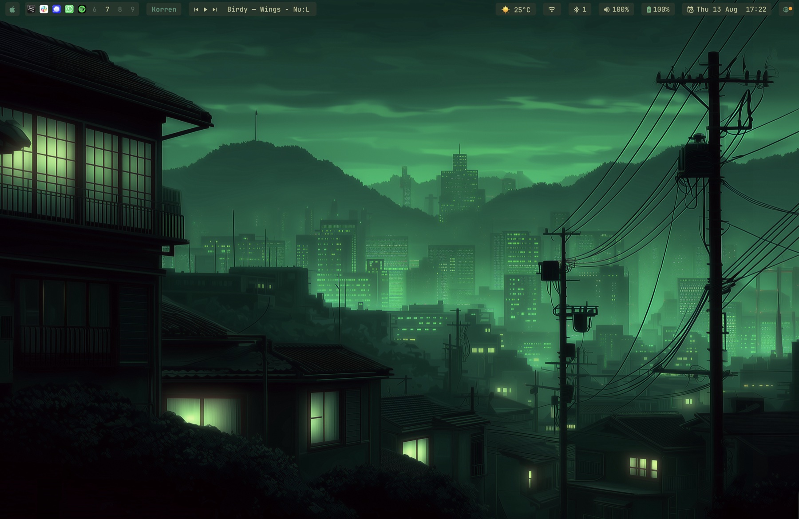
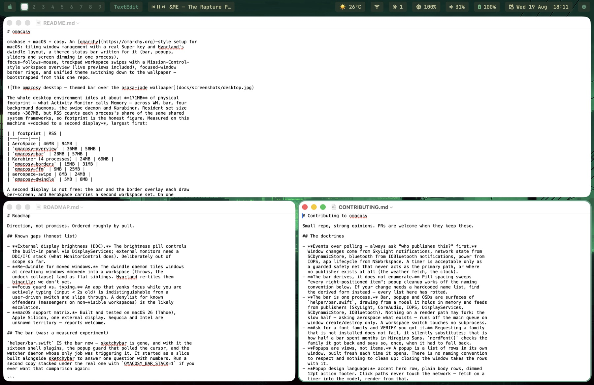
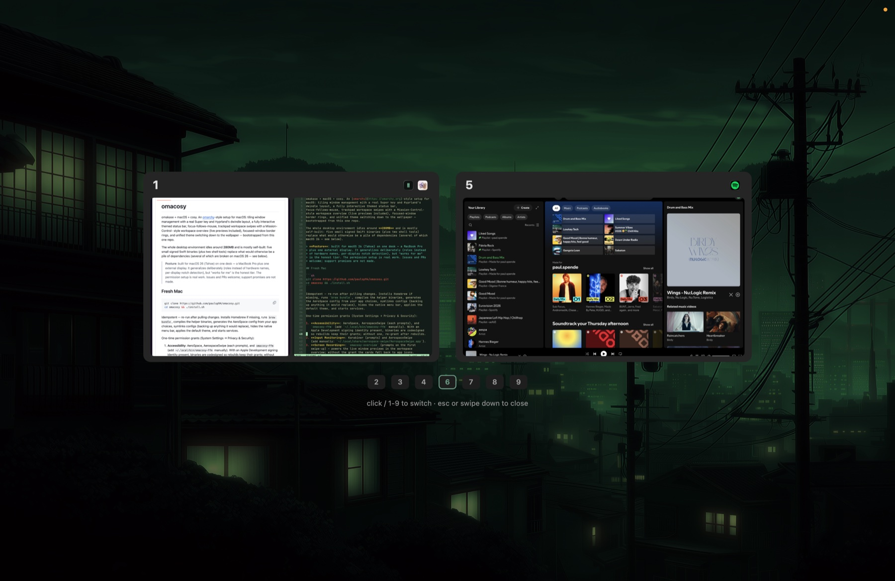

# omacosy

omakase + macOS + cosy. An [omarchy](https://omarchy.org)-style setup for
macOS: tiling window management with a real Super key and Hyprland's
dwindle layout, a fully interactive themed status bar,
focus-follows-mouse, trackpad workspace swipes with a Mission-Control-
style workspace overview (live previews included), focused-window
border rings, and unified theme switching down to the wallpaper —
bootstrapped from this one repo.



The whole desktop environment idles around **350MB all-in** (WM, bar,
six daemons — and a third of that is Karabiner's driver stack) and is
mostly self-built: six small signed Swift binaries (plus two shell
tools) replace what would otherwise be a pile of dependencies
(several of which are broken on macOS 26 — see below).

> **Posture**: built for macOS 26 (Tahoe) on one desk — a MacBook Pro
> plus one external display. It generalizes deliberately (roles instead
> of hardware names, per-display notch detection), but "works for me"
> is the honest tier. The permission setup is real work. Issues and PRs
> welcome; support promises are not made.

## Fresh Mac

```sh
git clone https://github.com/paulsp94/omacosy.git ~/.local/share/omacosy &&
cd ~/.local/share/omacosy && ./install.sh
```

The clone location matters: configs are symlinked into the repo, and
macOS privacy (TCC) blocks launchd services from reading
`~/Documents`, `~/Desktop` and `~/Downloads` — a clone there makes
the installer fall back to copying configs (still works; edits then
need an `install.sh` re-run to apply).

Idempotent — re-run after pulling changes. Installs Homebrew if
missing, runs `brew bundle`, compiles the helper binaries, generates
the AeroSpace config from your app choices, symlinks configs (backing
up anything it would replace), hides the native menu bar, applies the
default theme, and starts services.

One-time permission grants (System Settings → Privacy & Security):

1. **Accessibility**: AeroSpace, AerospaceSwipe (each prompts), and
   `omacosy-ffm` (add `~/.local/bin/omacosy-ffm` manually). With an
   Apple Development signing identity present, binaries are codesigned
   so rebuilds keep their grants; without one, re-grant after rebuilds.
2. **Input Monitoring**: Karabiner (prompts) and AerospaceSwipe
   (add manually: `~/.local/share/aerospace-swipe/AerospaceSwipe.app`).
3. **Screen Recording**: `omacosy-overview` (prompts on the first
   swipe-up) — powers the live window previews in the workspace
   overview; without the grant the cards fall back to app icons.
4. **Bluetooth**: sketchybar
   (add manually: `/opt/homebrew/opt/sketchybar/bin/sketchybar`),
   for the bar's bluetooth menu; `omacosy-watcher` (prompts at first
   start) — instant bluetooth pill updates on connect/disconnect.
5. Karabiner-Elements: approve its driver extension when prompted.

## App choices

Keybindings launch apps defined in `config/apps.conf` — defaults are
Ghostty, Safari, Spotify, Slack (terminal, browser, music, messenger).
Override any of them in `config/apps.local.conf` (gitignored), then
re-run `install.sh`:

```sh
# config/apps.local.conf — your picks win over apps.conf
TERMINAL=Korren
BROWSER=Arc
```

Your personal shell config belongs in `~/.zshrc.local` — the repo's
`zshrc` wires the CLI stack and sources it.

## What's inside

| Piece | Tool | Config |
|---|---|---|
| Tiling WM | [AeroSpace](https://github.com/nikitabobko/AeroSpace) | `config/aerospace/aerospace.template.toml` |
| Super key | [Karabiner](https://karabiner-elements.pqrs.org) (Caps Lock → cmd+ctrl+alt) | `config/karabiner/` (copied, not symlinked — TCC) |
| Status bar | [sketchybar](https://github.com/FelixKratz/SketchyBar) | `config/sketchybar/` |
| Window borders + fullscreen shroud | `omacosy-borders` (self-compiled launchd agent) | `helper/borders.swift`, `config/borders.conf` |
| Focus follows mouse | `omacosy-ffm` (self-compiled launchd agent) | `helper/ffm.swift`, `config/ffm-ignore` |
| Trackpad swipes | [aerospace-swipe](https://github.com/acsandmann/aerospace-swipe) + our patch | `config/aerospace-swipe/config.json`, `patches/` |
| Workspace overview | `omacosy-overview` (self-compiled resident daemon) | `helper/overview.swift` |
| Dwindle layout | `omacosy-dwindle` (self-compiled launchd agent) | `helper/dwindle.swift` |
| System events → bar triggers | `omacosy-watcher` (self-compiled launchd agent) | `helper/watcher.swift` |
| Park/restore the stack | `omacosy-toggle` | `bin/omacosy-toggle` |
| System glue | `omacosy-helper` (self-compiled) | `helper/main.swift` |
| Prompt | starship | `config/starship.toml` |
| Shell | zsh | `zsh/zshrc` + your `~/.zshrc.local` |
| CLI stack | fzf, eza, zoxide, ripgrep, bat, lazygit, btop | wired in `zsh/zshrc` |

Why self-built: on macOS 26, cooperative activation broke AutoRaise
(focus-follows-mouse), CGEvent taps stopped carrying multi-touch data
(breaking aerospace-swipe upstream — fix PRed as
[#29](https://github.com/acsandmann/aerospace-swipe/pull/29)/[#30](https://github.com/acsandmann/aerospace-swipe/pull/30)),
and JankyBorders' per-window bitmaps cost hundreds of MB.
`omacosy-ffm` focuses via the same SkyLight calls AeroSpace uses;
`omacosy-borders` strokes one CAShapeLayer the WindowServer rasterizes,
driven by the window server's own event stream (SkyLight notifications
for focus, move and resize — no polling, the ring glides with drags);
`omacosy-helper` covers wallpaper (System Events scripting half-broke
in macOS 14+), CoreAudio output switching, IOBluetooth control, cursor
position, and per-display notch detection. `omacosy-overview` and
`omacosy-dwindle` exist because neither a workspace overview nor a
dwindle layout can be had any other way — Mission Control can't see
virtual workspaces, and bsp is AeroSpace's most-requested missing
layout. `omacosy-watcher` turns system events — window churn,
bluetooth connects, network changes, battery ticks, Spotify's
lifetime — into bar refreshes, so the bar never polls for anything
macOS actually announces; its only remaining timers are the weather
fetch and the clock.

## The bar

Transparent bar, everything a flat radius-4 pill, one `GAP` constant
for spacing. Every popup closes when the cursor leaves it.

- **Apple menu** — About, System Settings, Lock, Sleep, Restart, Shut Down,
  Next Theme, Reload Bar (the menu the hidden native bar took away).
- **Workspaces** — one segmented capsule per monitor showing only that
  monitor's workspaces; accent pill on the focused one; click to jump.
- **Media** — prev / play-pause / next + track title (Spotify); centered
  on flat displays, left cluster on notched ones (real per-display
  notch detection — sketchybar's `q` position is unreliable), hidden
  when Spotify isn't running.
- **Bluetooth** — device menu (click to connect/disconnect), power
  toggle. **WiFi** — status, IP, power toggle (macOS 26 hides SSIDs
  from CLI tools). **Weather** — wttr.in, cached details popup.
  **Volume** — scroll adjusts, click opens slider + output-device menu,
  right-click mutes. **Brightness** — built-in display; scroll
  adjusts, click opens a slider (DisplayServices, no deps).
  **Battery** / **Clock** (calendar popup) /
  **Activity** (floating btop).

## Keybindings — Super = hold Caps Lock

Karabiner remaps Caps Lock to `cmd+ctrl+alt` (a combo macOS never
uses), so omarchy's scheme works letter-for-letter without breaking
typing or app shortcuts. Caps Lock tapped alone is Escape.

| Chord | Action |
|---|---|
| `Super+enter` | new terminal window |
| `Super+shift+enter` | browser |
| `Super+space` | launcher (Raycast) |
| `Super+w` | close window |
| `Super+arrows` | focus window |
| `Super+shift+arrows` | move window |
| `Super+1..9` | switch workspace |
| `Super+shift+1..9` | move window to workspace (and follow) |
| `Super+s` / `Super+shift+s` | scratchpad workspace (toggle / send window) |
| `Super+tab` | previous workspace |
| `Super+shift+tab` | throw window to same slot on other monitor |
| `Super+shift+space` | throw WHOLE workspace to other monitor |
| `Super+f` | fullscreen — on notched displays the camera strip is blacked out so it reads as true fullscreen, while the window stays in its workspace (swipes still reach it) |
| `Super+n` | native macOS fullscreen (a separate Space — outside the workspace model, avoid unless an app needs it) |
| `Super+t` | toggle floating |
| `Super+j` | toggle split direction |
| `Super+-` / `Super+=` | resize |
| `Super+shift+f/m/g` | files / music / messenger |
| `Super+shift+b` | btop (floating) |
| `Super+shift+t` | next theme |
| `Super+l` | lock screen |
| `Super+esc` |  system menu |
| `Super+r` | resize mode (`h/j/k/l`, `-`/`=`, `esc`) |
| `Super+shift+;` | service mode (`esc` reload, `r` flatten, `⌫` close others) |

Each display owns an independent set of NINE workspaces, omarchy
style: main holds 1–9, secondary holds 11–19 — same last digit = same
slot, and the bar and overview render only the slot digit. `Super+N`
switches the focused monitor's slot N (via `omacosy-ws`);
`Super+Shift+N` moves the window to that slot; `Super+Shift+Tab`
throws the window to the same slot on the other monitor. On a single
display the secondary set falls back to main and sits empty. Windows
open on the workspace you're on; nothing is auto-assigned by app.

## Themes

`theme-set <name>` switches everything at once — bar, borders,
wallpaper on every display, and any terminal that follows omarchy's
`~/.config/omarchy/current/theme` convention (the author's does).
`Super+Shift+T` cycles.

Themes: `tokyo-night`, `catppuccin`, `gruvbox`, `osaka-jade`. Each
`themes/<name>/` holds `colors.toml` (omarchy's 22-color palette),
`sketchybar.sh` / `borders.sh` (bar and ring colors — the ring uses the
theme accent, omarchy's own convention), and `backgrounds/` (wallpapers
from omarchy's MIT-licensed theme packs). Copy a directory to add one.

## Tiling: dwindle



AeroSpace natively inserts new windows as equal siblings (three
windows = three columns). `omacosy-dwindle` grafts Hyprland's dwindle
on top: each new tiled window splits the focused window's own slot,
alternating direction — the omarchy spiral, automatic. It touches a
window exactly once (at birth), stands down for floats and while the
overview is open, and `touch ~/.config/omacosy/no-dwindle` disables it
live. Manual control (Super+J flips, resize, float) works unchanged.

Floats get a rescue path, because macOS will not keep them on top:
z-order is per *app*, not per window, so a float sinks behind whichever
app you focus next, and pinning it would mean rewriting the window's
level through a private call with SIP off. Instead the bar grows a pill
whenever the focused workspace is holding floats, and **Super+S** — or
a click on that pill — surfaces the next one and brings the cursor with
it, so a float is never lost behind a tile and never retrieved by
aiming at something you cannot see.

## Focus follows mouse & swipes

`omacosy-ffm`: hover focuses (no raise over floating windows — floats
stay in front), event-driven off mouse *movement* so a parked cursor
never steals focus from a launching window, never during drags,
per-app opt-out in `config/ffm-ignore` (omarchy's JetBrains-style
exception). 4-finger swipes left/right switch workspaces on **the
display under the cursor** (native-Spaces semantics), wrap-around, any
trackpad. The system's own 4-finger gestures are disabled by
`macos-defaults.sh` so Mission Control never fights the daemon
(`uninstall.sh` restores them).

## Workspace overview



4-finger **swipe up**: the wallpaper breathes in behind a dim wash and
every non-empty workspace OF THE CURSOR'S MONITOR gets a card (per-
display Mission Control semantics) — live window previews
(ScreenCaptureKit, composed into the tile layout), app icons, the
focused workspace accent-ringed. Click a card or press its digit to
jump; empty workspaces show as small chips (digits work for them too —
straight to a clean screen). **Swipe down**, Esc, or a backdrop click
dismisses. Resident daemon, so it opens instantly.

## Parking the setup

`omacosy-toggle off` returns to a vanilla Mac in one command (AeroSpace
stops managing, all daemons and the bar stop) without uninstalling;
`omacosy-toggle on` brings everything back. No argument flips.

## Back to a normal Mac

```sh
./uninstall.sh
```

Manifest-driven: `install.sh` records what THIS machine actually
gained (Homebrew packages that weren't already present, cloned repos,
every `defaults` key's prior value), and `uninstall.sh` removes and
restores exactly that — tools and settings you had before omacosy are
never touched. Pre-manifest installs fall back to a conservative
teardown that leaves all Homebrew packages in place.

## License & credits

MIT (see `LICENSE`). Standing on: [omarchy](https://omarchy.org)
(the whole idea, plus MIT-licensed theme palettes and wallpapers),
[AeroSpace](https://github.com/nikitabobko/AeroSpace),
[sketchybar](https://github.com/FelixKratz/SketchyBar),
[Karabiner-Elements](https://karabiner-elements.pqrs.org),
[aerospace-swipe](https://github.com/acsandmann/aerospace-swipe) (MIT;
patched here for macOS 26, fixes offered upstream).
